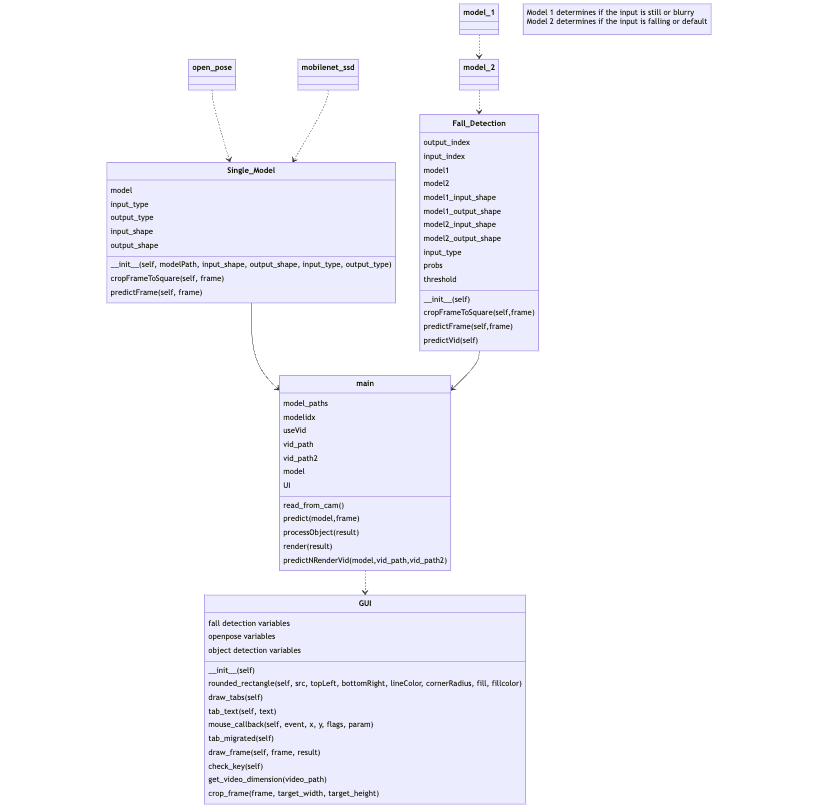

# VIA-Fall-Detection

**- main.py:** main script, uses model scripts (e.g. Fall_Detection.py)  
**- Fall_Detection.py:** uses compiler_and_runtime/Neuropl/neuropl (python wrapper of API for fall detection the model) and GUI 
**- neuropl.cpp:** uses compiler_and_runtime/Neuropl/RuntimeAPI(runtime.cpp) 

# Complete System Illustration (MobileNet Object Detection, Openpose, Fall Detection)

**Overview of system features:** 

- The diagram is a complete illustration of the system that integrates object detection, openpose, and fall detection.
- Object Detection and Open pose are adapted from open source projects
- Fall Detection is custom made and trained
 

**Display interface and Hardware Usage:**

- OpenCV was used to create the display GUI
- Hardware usage: all system features are run and compiled on VIA's VAB-912.

  

